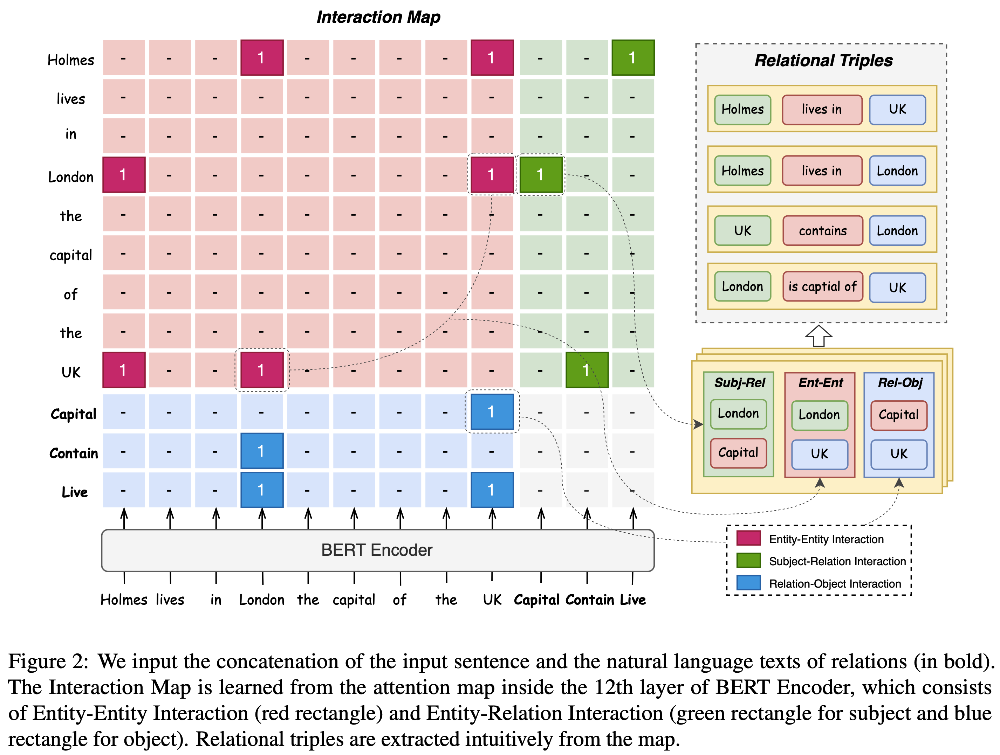
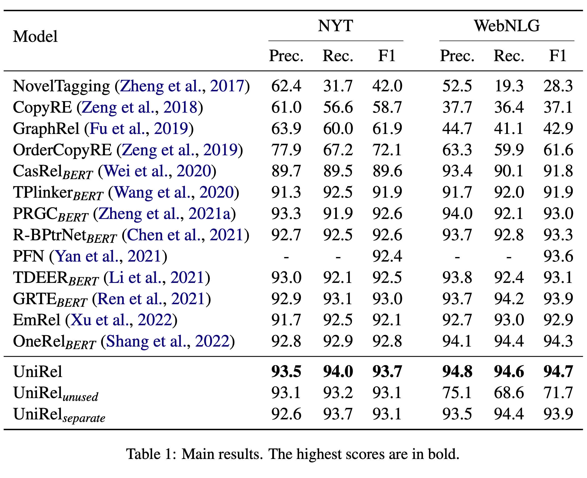
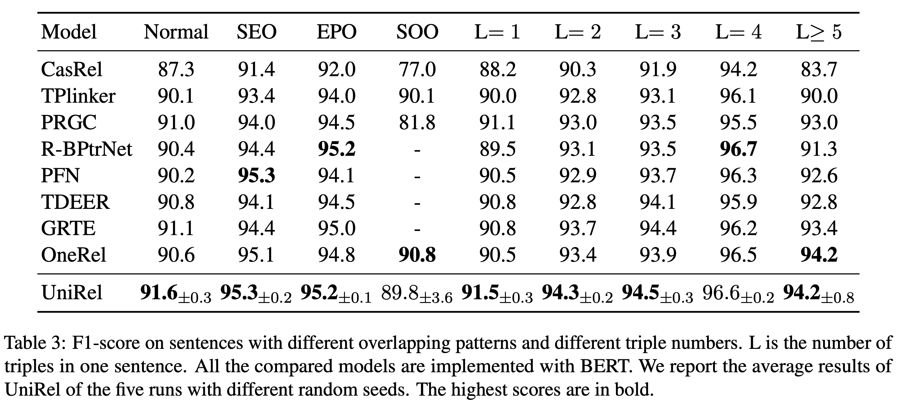

# UniRel

Released code for our EMNLP22 paper: [UniRel: Unified Representation and Interaction for Joint Relational Triple Extraction](https://arxiv.org/abs/2211.09039).

Join the [Discord](https://discord.gg/RGSruSmA8s) if there are any questions.

# Updates
- 2023-06-01
  - Add multi-token entity implementation.
  - Provide `UniRel` class in `predict.py` for easy inference and a [checkpoint](https://drive.google.com/drive/folders/1poRbtpm5ddbwUk3mVQ2-4G_o3OPXjYNq?usp=sharing) trained on nyt (multi-token) for trying.

# Model



# Results





# Usage

## Prerequisites

UniRel is implemented with `Python == 3.8` and `pytorch == 1.7.1`, Other main requirments are:
- tdqm
- transformers == 4.12.5
- wandb 

The detail requirments could be found at `requirements.txt`

## Data

We obtain the data from TPLinker, please kindly refer to [TPLinker officail repository](https://github.com/131250208/TPlinker-joint-extraction). Change two filename of the download data: 
- `train_data.json` -> `train_split.json`
- `test_triples.json` -> `test_data.json`

You can also download the data from [here](https://drive.google.com/file/d/1-3uBc_VfaCEWO2_FegzSyBXNeFmqhv7x/view)


## Pretrained Model

We use the `bert-base-cased` model from Huggingface, you can download it by following their [instrcution](https://huggingface.co/bert-base-cased?text=The+goal+of+life+is+%5BMASK%5D.) or let Transformers to automatically download. After that, place the files at the root directory of the project (`./bert-base-cased`).

I provided a checkpoint for trying `predict`. You can download [here](https://drive.google.com/drive/folders/1poRbtpm5ddbwUk3mVQ2-4G_o3OPXjYNq?usp=sharing).

## Train & Evalutaion

All parameter are listed in the script `run_nyt.sh` and `run_webnlg.sh`. By run with command `bash run_nyt.sh` can do train and evaluation.

# Citation
```
@inproceedings{tang-etal-2022-unirel,
    title = "{U}ni{R}el: Unified Representation and Interaction for Joint Relational Triple Extraction",
    author = "Tang, Wei  and
      Xu, Benfeng  and
      Zhao, Yuyue  and
      Mao, Zhendong  and
      Liu, Yifeng  and
      Liao, Yong  and
      Xie, Haiyong",
    booktitle = "Proceedings of the 2022 Conference on Empirical Methods in Natural Language Processing",
    month = dec,
    year = "2022",
    address = "Abu Dhabi, United Arab Emirates",
    publisher = "Association for Computational Linguistics",
    url = "https://aclanthology.org/2022.emnlp-main.477",
    pages = "7087--7099",
}
```

---

Have a nice day.
